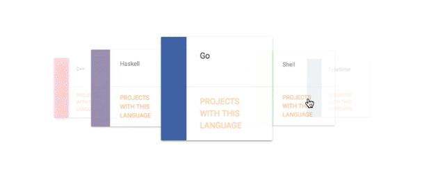

# git-lang-cards


This is a React.js component for providing a carousel of cards. The cards show the languages the consumer likes to dabble in on GitHub. There is a link in the cards to go the consumer's GitHub projects filtered for the particular language.

By using Materialize CSS the component gains touch compatibility :D

### Motivation:

I made this component for my personal website. Decided to make it available for everyone to use and enjoy :)

### Demo:

Following is the demo GIF of the component:



### Usage:

* Include the dependencies as script tags in the HTML file:

Inside `<head>`:

```HTML
<script src="https://code.jquery.com/jquery-3.2.1.min.js" integrity="sha256-hwg4gsxgFZhOsEEamdOYGBf13FyQuiTwlAQgxVSNgt4="
    crossorigin="anonymous"></script>
<script src="https://cdnjs.cloudflare.com/ajax/libs/materialize/0.100.2/js/materialize.min.js"></script>
<script src="https://cdnjs.cloudflare.com/ajax/libs/react/16.0.0/umd/react.production.min.js" crossorigin="anonymous"></script>
<script src="https://cdnjs.cloudflare.com/ajax/libs/react-dom/16.0.0/umd/react-dom.production.min.js" crossorigin="anonymous"></script>
```

Inside `<body>`:

```HTML
<div class="container">
  <div id="root"></div>
</div>
```

> Note: The library is exported as `gitlangcards` following the UMD convention — it can be consumed by all module systems in their native forms. For eg in CommonJS, consume as `require("gitlangcards")`.


* Library name: `gitlangcards`

* In JS script:

```javascript
// `gitlangcards` is the library, since I've added the bundle as a script, I can consume the library freely
// as a global variable
// The `render()` of the `GitHubLanguageColors` object takes 3 parameters:
// 1. The GitHub user name
// 2. The elementId of the div the carousel needs to be rendered inside
// 3. The callback function that needs to be called after the carousel(component) 
//    has been rendered on the screen
new gitlangcards.GitHubLanguageColors().renderOnScreen("sidmishraw", "root", () => console.log("Done"));
```

> Note: I'd recommend add the bundled js after the body elements have rendered for faster processing.

```HTML
<!-- towards the end of the <body> tag -->
<script type="text/javascript" src=".././bin/materialize.bundle.js"></script>
<script type="text/javascript" src=".././bin/gitlangcards.bundle.js"></script>
```

> Note: load the `materialize.bundle.js` before the `gitlangcards.bundle.js` since it satisfies the CSS and JS dependencies in `gitlangcards.bundle.js`. I believe this holds only in `root` or HTML script include method for JS files. CommonJS, CommonJS2, and AMD module systems follow their conventions.


### Consumer dependencies:

* "jquery"          : "^3.2.1"

* "materialize-css" : "^0.100.2"

* "react"           : "^16.0.0"

* "react-dom"       : "^16.0.0"


### Developer dependencies:

* "babel-core"                  : "^6.26.0"

* "babel-loader"                : "^7.1.2"

* "babel-preset-env"            : "^1.6.1"

* "babel-preset-react"          : "^6.24.1"

* "css-loader"                  : "^0.28.7"

* "extract-text-webpack-plugin" : "^3.0.2"

* "file-loader"                 : "^1.1.5"

* "html-webpack-plugin"         : "^2.30.1"

* "materialize-loader"          : "^2.0.2"

* "path"                        : "^0.12.7"

* "style-loader"                : "^0.19.0"

* "url-loader"                  : "^0.6.2"

* "webpack"                     : "^3.8.1"

* "webpack-dev-server"          : "^2.9.4"


### Dev builds:

```shell
yarn install          # installs all the dependencies and sets up the project

yarn build            # builds the distributables or bundles in the ${PROJECT_ROOT}/bin directory

yarn clean            # cleans the distributables

yarn rebuild          # cleans and builds -- fails of bin directory is not there

yarn start --watch    # starts the webpack-dev-server for live feedback -- http://localhost:8080/bin/app.html
```

`-Sid`